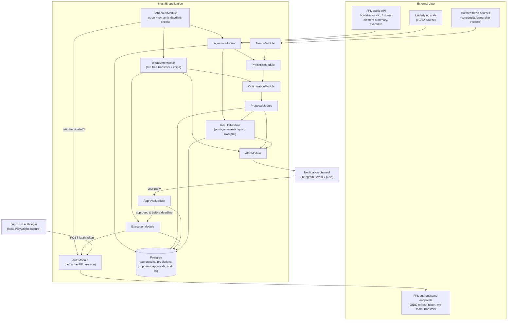
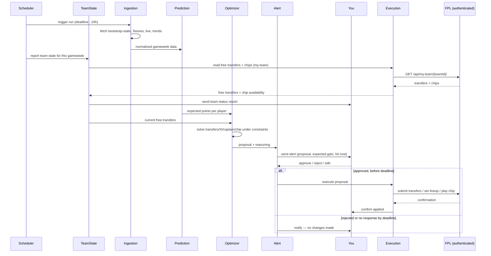

# FPL Assistant Bot — Architecture

A NestJS service that ingests gameweek data, predicts the optimal squad, **alerts you**, and only touches your FPL team after you explicitly approve.

Autonomy mode locked in: **alert → wait for your OK → apply**. Nothing writes to your FPL account without a confirmed response from you.

---

## 1. Constraints that shape the design

- **No official write API.** FPL only publicly documents read endpoints. Setting transfers/lineup means driving the same private endpoints the official web app uses, authenticated as you. This is unsupported by FPL, undocumented, and can change without notice — the execution layer needs to be the most isolated, most defensively-coded part of the system.
- **Deadlines move.** Gameweek deadlines are not reliably "Friday 6PM" — blank/double gameweeks and rescheduled fixtures shift them. The bot must read the actual deadline from the API each cycle, never assume a fixed cron time.
- **Human-in-the-loop is a hard gate, not a notification.** The execution step must be blocked on an explicit approval record, with a defined fallback (do nothing) if you don't respond in time.
- **"Social trends from top FPL players" has no clean API.** Treat this as a curated-sources problem (a watchlist of community sites/rank trackers that already aggregate consensus), not a live social-scraping problem — scraping X/Twitter/YouTube reliably and within ToS is its own project and a fragile foundation to build the rest on.

---

## 2. High-level architecture



---

## 3. Module breakdown

| Module | Responsibility |
|---|---|
| **SchedulerModule** | **Implemented differently than sketched here**: not a cron entry point that schedules a single future run, but an hourly poll (`DeadlineWatcherService`) that re-checks `bootstrap-static`'s next deadline every cycle and fires once the configurable lead time (`DEADLINE_LEAD_HOURS`) is reached. Simpler than pre-computing a scheduled run, and self-corrects if FPL reschedules a deadline after the last check. Still never hardcodes "Friday." |
| **IngestionModule** | Typed clients for FPL's public endpoints + external stats source. Normalizes into internal `Player`, `Fixture`, `GameweekSnapshot` entities. Idempotent — safe to re-run per gameweek. |
| **TrendsModule** | Pulls from a small, explicit whitelist of consensus/rank-tracker sources you approve in config (not open-ended scraping). Produces a lightweight "template team" / differential signal to feed the model, clearly labeled as a secondary signal. |
| **PredictionModule** | Feature engineering (form, fixture difficulty, underlying stats, price/ownership deltas, minutes risk) → expected-points score per player per fixture. Model swappable behind an interface (`PredictionStrategy`) — start heuristic, upgrade to a trained model later without touching the rest of the pipeline. |
| **OptimizationModule** | Given predicted points + budget/formation/club-limit constraints + current squad, solves for the best transfer(s), starting XI, captain/vice, and bench order. Integer/linear programming, not a greedy heuristic. "Also evaluates whether a chip is worth playing" is still aspirational, not built: `ChipEvaluatorService` is a deliberate stub (see CLAUDE.md) — chip play is a manual declaration today (`POST /proposal/chip`), factored into the same ILP once told, never decided automatically. |
| **TeamStateModule** | Not in the original design — added 2026-09-08, reworked same day. Reads current free transfers and chip availability live from FPL (`GET /api/my-team/{teamId}/`, via `ExecutionModule` — see §4 — never `FplAuthClient` directly, keeping the isolation rule below intact) and sends it as an informational report through `AlertModule` before each week's proposal; the free-transfer count feeds into `OptimizationModule`. An earlier version asked you these questions over Telegram instead, on the assumption the data wasn't otherwise available — that assumption turned out wrong. See `CLAUDE.md`'s "Weekly team-status report". |
| **ProposalModule** | Packages the optimizer's output into a `Proposal` record: recommended changes, expected point delta, reasoning summary, and a hit cost if applicable. Persisted with status `PENDING`. |
| **AlertModule** | Renders the proposal into a human-readable message and sends it through your chosen channel, with an explicit approve/reject/edit action. |
| **ApprovalModule** | Owns the state machine: `PENDING → APPROVED / REJECTED / EXPIRED`. Only a signed, verifiable response from you moves it out of `PENDING`. If deadline passes with no response, it auto-expires — **the fallback on silence is always "do nothing,"** never "apply anyway." Also, not in the original design — added 2026-09-08: the moment a proposal expires, it sends a one-time Telegram Yes/No check-in ("Did you apply my suggestion?") purely to label the real-world outcome for future backtesting; never gates or re-triggers execution. See CLAUDE.md's "Post-deadline applied-manually check-in". Also the single Telegram webhook entry point for slash commands (`/status`, `/propose`, `/login`, `/help`), delegated to `TelegramCommandsModule` — see CLAUDE.md's "Telegram slash commands". |
| **ExecutionModule** | Triggered exclusively by an `APPROVED` proposal, re-validates the deadline hasn't passed, applies the change, and writes a full audit record (payload sent, response received, timestamp). Uses `FplAuthClient` from `AuthModule` (below) — the one other module allowed to hold the authenticated session directly. |
| **AuthModule** | Not in the original design — added 2026-09-08. Now the *only* module holding `FplAuthClient`/the authenticated session (moved out of `ExecutionModule` so auth concerns — "are we logged in, how do we get logged in" — are separate from execution concerns — "given a session, apply this proposal"). `AuthService.isAuthenticated()`/`assertAuthenticated()` are the narrow surface everything else uses. `POST /auth/token` (shared-secret guarded) lets `scripts/auth-login.ts`'s Playwright-assisted local login push a freshly-captured token into a running instance — see CLAUDE.md's "Execution auth". |
| **ResultsModule** | Not in the original design — added 2026-09-08. Runs its own hourly poll, independent of `SchedulerModule` and entirely public-API driven (no authenticated call needed), and — once a proposal's gameweek is marked `finished` — sends a predicted-vs-actual points comparison for *every* terminal proposal (`APPROVED`/`REJECTED`/`EXPIRED`, not only the ones that went unanswered). "Predicted" is a full FPL-accurate simulation (formation-aware autosubs, captaincy transfer to the vice-captain, each chip's scoring effect), not an approximation. Deliberately a separate trigger from `ApprovalModule`'s post-deadline check-in below — that one fires at the deadline, days before a gameweek's matches are even played, so it can never itself carry a score. See CLAUDE.md's "Post-gameweek results report". |

---

## 4. Data sources

| Source | Type | Use |
|---|---|---|
| `GET /api/bootstrap-static/` | Public | Players, teams, gameweek metadata, **deadline times**, price/ownership snapshot |
| `GET /api/fixtures/?event={gw}` | Public | Fixture list & difficulty for a gameweek |
| `GET /api/element-summary/{id}/` | Public | Per-player fixture history and upcoming fixtures |
| `GET /api/event/{gw}/live/` | Public | Live per-player stats once a gameweek is underway — normalized 2026-09-08 (`IngestionService.getGameweekPlayerStats`, `{totalPoints, minutes, played}` per player) once `ResultsModule` became the first real consumer, for the autosub/scoring simulation behind the post-gameweek report |
| `GET /api/entry/{teamId}/` , `/history/`, `/event/{gw}/picks/` | Public | Your own team's current state and history; `entry_history.points` (added to the typed shape 2026-09-08) is the actual points scored a given gameweek, used by `ResultsModule` as the "what really happened" side of its comparison |
| External xG/xA source (e.g. Understat) | Public, unofficial | Underlying-stats features the FPL API doesn't expose |
| Curated trend sources (config-driven whitelist) | Public, unofficial | Community consensus / template-team signal |
| `POST https://account.premierleague.com/as/token` (OIDC, PingOne DaVinci, `grant_type=refresh_token`) | Authenticated | Exchanges a manually-captured refresh token for a short-lived access token. **Supersedes** the session email/password login originally assumed here — FPL moved auth to a hosted OIDC identity provider with a bot-guarded interactive login step, discovered live 2026-09-07. See `CLAUDE.md`'s "Execution auth" section. |
| `GET/POST /api/my-team/{teamId}/` | Authenticated | Read/write your current squad, lineup, captain, chip. Also returns your current free-transfer count and per-chip availability (`transfers`/`chips` fields) — `TeamStateModule` reads these instead of asking you (discovered live 2026-09-08; see §3's `TeamStateModule` row). |
| `POST /api/transfers/` | Authenticated | Submit transfers — single `confirmed: true` request applies it directly. **Not** the dry-run-then-commit pattern a community library assumed: verified live 2026-09-08 that `confirmed: false` alone already applies the transfer, no second call needed (or safe to send). |

The authenticated endpoints are undocumented and only known through community reverse-engineering — before building `ExecutionModule`, capture the exact request/response shapes yourself via your browser's network tab while making a manual transfer, rather than trusting a third-party writeup verbatim. Contracts here can drift season to season. **Done for auth, `/api/my-team/`, `/api/transfers/`, and `setLineup`'s `chip` field** (captured/verified live 2026-09-07 and 2026-09-08, see `CLAUDE.md`'s "Execution auth") — Bench Boost and Triple Captain both verified live 2026-09-08 (including resolving whether the ×3 is client-sent or server-derived: it's server-derived, from the `chip` field alone); only `/api/transfers/`'s `wildcard`/`freehit` flags remain unverified, blocked on this test account not yet having a saved squad/gameweek history.

---

## 5. Weekly pipeline (sequence)



---

## 6. Persistence (implemented)

The sketch below is now real, via Postgres + TypeORM
(`src/persistence/entities/`, migrations in `src/persistence/migrations/`).
Field names differ cosmetically (camelCase, per TS/TypeORM convention, not
snake_case), and a few fields were added as building revealed the need
(`Gameweek.finished`; `Proposal.deadlineAt`, `benchGoalkeeperId`,
`benchOutfieldIds`, `viceCaptainId`, `appliedManually`, `resultReportedAt`)
— otherwise this is still an accurate picture of the schema. See
`CLAUDE.md`'s "Persistence" section for the Docker/migration workflow.

**Season-scoped identity (added 2026-09-08).** FPL's gameweek `id` resets
to 1 every season with no season field anywhere in `bootstrap-static` to
disambiguate — discovered live once this bot had been running long enough
for the question to matter. Left unaddressed, this would have silently
collided across a season rollover: `Gameweek`/`PlayerSnapshot`'s primary
keys and `Proposal`'s restart-safe dedupe lookup would all match a prior
season's row with the same gameweek number, most seriously causing the
scheduler to conclude "already proposed this gameweek" for an entire new
season and silently stop generating proposals. Fixed with a derived
`season` field ("YY_YY", from each gameweek's own deadline —
`src/common/utils/season.util.ts`) threaded through as part of the
identity everywhere gameweek number alone isn't unique enough:
`Gameweek`/`Proposal.season`, plus composite primary keys on
`Gameweek`/`PlayerSnapshot`. `Gameweek.id` itself is untouched — it's the
real FPL event id needed for API calls, only its *uniqueness* needed
fixing.

```
Gameweek(id, season, deadline_at, is_current, is_next, finished)
PlayerSnapshot(gameweek_id, season, player_id, price, ownership_pct, predicted_points, form, xg, xa, ...)
Proposal(id, gameweek_id, season, transfers_json, lineup_json, captain_id, chip, expected_gain, hit_cost, status, created_at, applied_manually, result_reported_at)
Approval(proposal_id, decided_by, decision, decided_at)
ExecutionLog(proposal_id, request_payload, response_payload, applied_at, success)
```

Keeping `PlayerSnapshot` per gameweek (not overwritten) gives you a backtestable history — essential for eventually checking whether the prediction model is actually adding value over a naive baseline (e.g. "just captain the highest-owned premium"). Written best-effort from `PredictionService` on every proposal generation — a write failure there must never block alerting the actual proposal.

A `TeamState` table briefly existed here (added, then dropped, both 2026-09-08) to back a weekly Telegram Q&A for free transfers/chip availability — removed once that data turned out to be readable live from FPL instead (see §3's `TeamStateModule` row). Worth noting only so a future session doesn't wonder why a migration adds and then drops the same table.

---

## 7. Notification & approval channel

Needs to be two-way, not just push. A few options, roughly in order of how little glue code they need:

- **Telegram bot** — free, trivial NestJS integration, native inline "Approve / Reject" buttons, webhook delivers the reply straight back into `ApprovalModule`. Easiest fit for this exact flow.
- **Email + a signed one-click link** — works everywhere, slightly more plumbing (need a small web endpoint for the link to hit).
- **Push notification service** (e.g. Pushover/ntfy) — simple to send, but round-tripping an approval back in usually still needs a companion channel (link or reply).

Whichever you pick, the approval record should be cryptographically tied to the specific proposal (a signed token, not just "reply OK") so a stray message can't accidentally approve the wrong week.

**Decided: Telegram bot**, implemented (`AlertModule`/`ApprovalModule`). One
simplification from the recommendation above: approvals aren't a separately
signed token — they ride on Telegram's own inline-button `callback_data`
(`approve:<proposalId>` / `reject:<proposalId>`), checked against the
configured chat id. Telegram's `callback_query` only ever fires from an
actual tap on that exact button in that exact message, which already
satisfies "a stray message can't accidentally approve the wrong week"
without a separate signing layer. A second callback namespace
(`appliedyes:<id>` / `appliedno:<id>`) was added 2026-09-08 for the
post-deadline check-in (§3's `ApprovalModule` row) — same binding
mechanism, but it labels an already-terminal proposal rather than
deciding one, so it bypasses the approval state machine entirely.

---

## 8. Tech stack recommendation

| Concern | Suggestion |
|---|---|
| Framework | NestJS + TypeScript (as planned) |
| Scheduling | **Decided: a plain hourly `setInterval` poll** (`DeadlineWatcherService`), not `@nestjs/schedule` + a BullMQ/Redis queue as suggested here — simpler, and reasonable for a single-user, once-a-week workload. Revisit only if retry/backoff semantics become a real problem. |
| DB | **Decided: Postgres + TypeORM**, explicit migrations, run locally via Docker — see `CLAUDE.md`'s "Persistence" section. |
| Optimization | `javascript-lp-solver` (pure TS, fine for squad-sized ILP) — or, if the model outgrows it, a small internal Python microservice (PuLP/OR-Tools) called over HTTP, keeping NestJS as the orchestrator |
| HTTP client for FPL | `axios`/`undici` with a dedicated cookie-jar-aware client for the authenticated session, isolated in `ExecutionModule` only |
| Secrets | **As built: a gitignored `.env`** locally, `fly secrets set` in production — not a dedicated secrets manager as suggested here, reasonable for a single-user setup. See `CLAUDE.md`'s deploy section. |
| Notifications | Telegram Bot API (see §7) — decided, implemented |
| CI/CD | **Decided: GitHub Actions + Fly.io**, not a heavier CI/CD platform — reasonable for a single-user setup. CI (lint/type-check/test) runs on every push and PR; Deploy is gated on CI's own completion (`workflow_run`, not a parallel `push` trigger — the two ran in parallel with no ordering guarantee in an earlier version, letting Deploy finish before Test even completed) and only fires `if: conclusion == 'success'`. `main` is branch-protected (PR + 1 approval required, repo admin exempt) so the repo being public never lets an unreviewed push reach the deploy pipeline. See `CLAUDE.md`'s "Deploy (Fly.io) + CI/CD" section. |

---

## 9. Suggested module/folder layout

```
src/
  ingestion/
    fpl-public.client.ts
    stats-provider.client.ts
    ingestion.service.ts
  trends/
    trend-sources.config.ts
    trends.service.ts
  prediction/
    prediction.strategy.ts        # interface
    heuristic.strategy.ts         # v1
    trained-model.strategy.ts     # v2, later
  optimization/
    squad-optimizer.service.ts
    chip-evaluator.service.ts
  proposal/
    proposal.entity.ts
    proposal.service.ts
  alert/
    telegram.adapter.ts
    alert.service.ts
  approval/
    approval.state-machine.ts
    approval.controller.ts        # webhook for your reply
  execution/
    fpl-auth.client.ts            # isolated, most sensitive module
    execution.service.ts
  scheduler/
    deadline-watcher.service.ts
```

The actual layout groups some of these under subfolders
(`ingestion/clients/`, `execution/clients/`, `alert/adapters/`,
`prediction/strategies/`) and adds directories this sketch didn't
anticipate: `persistence/` (entities + migrations, one place for the whole
schema — see §6), `common/` (shared domain types/enums/interfaces used
across modules), `config/` (typed env config for `@nestjs/config`),
`team-state/` (§3's `TeamStateModule`), `auth/` (§3's `AuthModule` —
`FplAuthClient` now lives at `auth/clients/`, not `execution/clients/` as
this sketch's `execution/fpl-auth.client.ts` entry implies), and
`results/` (§3's `ResultsModule` — `gameweek-scoring.util.ts` is the
autosub/chip-accurate scoring simulation, kept as a standalone pure
function specifically so its correctness could be tested in isolation
from the rest of the module). The real `src/` tree is authoritative over
this sketch.

---

## 10. Risks & mitigations

| Risk | Mitigation |
|---|---|
| FPL changes/blocks the unofficial write endpoints | Keep `ExecutionModule` fully isolated behind an interface; treat it as the one part of the system expected to need occasional repair; alert loudly (not silently) on execution failure |
| Wrong deadline assumption causes a missed or late change | Always derive the deadline from `bootstrap-static` per run; schedule with margin; re-check immediately before executing |
| Approval race / stale proposal | Bind approvals to a specific proposal ID + gameweek; reject any approval that arrives after that gameweek's deadline |
| Credential compromise | Isolate credentials to the execution module only; encrypt at rest; rotate session rather than storing raw password where possible |
| Model overconfidence | Log every proposal's predicted vs. actual points; treat prediction as a decision-support signal, not a guarantee — realistically, beating informed human consensus by a wide margin is hard. **Implemented 2026-09-08** as `ResultsModule`'s post-gameweek report (§3) — a real per-proposal predicted-vs-actual comparison, not just a plan. |
| Scraping social/trend sources breaks or gets blocked | Use a small explicit source whitelist you control, not open-ended scraping; degrade gracefully (proceed on model + fixtures alone) if a source is unavailable |
| Public repo + auto-deploy lets an unreviewed change reach production | `main` branch-protected — anyone but the repo admin needs an approved PR to merge (admin can still push directly); CI triggers on plain `pull_request` (not `pull_request_target`), so a fork's PR never gets repo secrets; Deploy only runs after CI itself succeeds (see §8's CI/CD row) |

---

## 11. Suggested build order

Current status (checkmarks, what's next, open questions) is tracked live in
`CLAUDE.md`'s "Build order" section, not duplicated here — this is the
original plan as sketched.

1. **Ingestion + prediction + optimization, recommend-only.** No execution module at all yet — just get a weekly Telegram message with a proposed team and confidence you'd actually want to send it.
2. **Add the approval state machine and alert loop**, still without execution — verify the "propose → you decide → expire on silence" flow end-to-end.
3. **Add `ExecutionModule` for lineup/captain changes only** (lower risk than transfers) once the flow above is trustworthy.
4. **Extend execution to transfers and chips**, with the audit log and rollback story proven out first.
5. **Iterate the prediction model** using the backtestable `PlayerSnapshot` history from step 1 onward.

---

## Sources

- [Oliver Looney — FPL APIs Explained](https://www.oliverlooney.com/blogs/FPL-APIs-Explained)
- [FPL API cheatsheet (sertalpbilal, via glama mirror)](https://glama.ai/mcp/servers/@owen-lacey/fpl-mcp/blob/e9171d6bb4bc00c522d02752962554112a340d30/docs/fpl-api-cheatsheet.md)
- [amosbastian/fpl — Python FPL library source](https://github.com/amosbastian/fpl/blob/master/fpl/fpl.py)
- [mcclowes/fpl-oas — Unofficial OpenAPI docs for the FPL API](https://github.com/mcclowes/fpl-oas)
