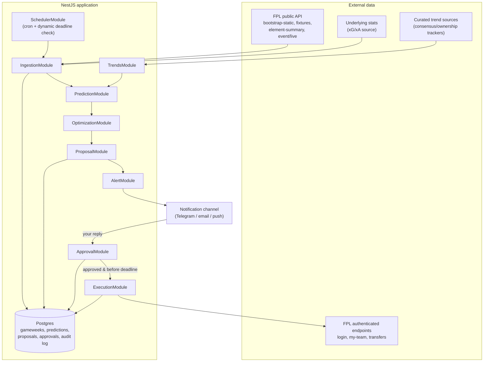
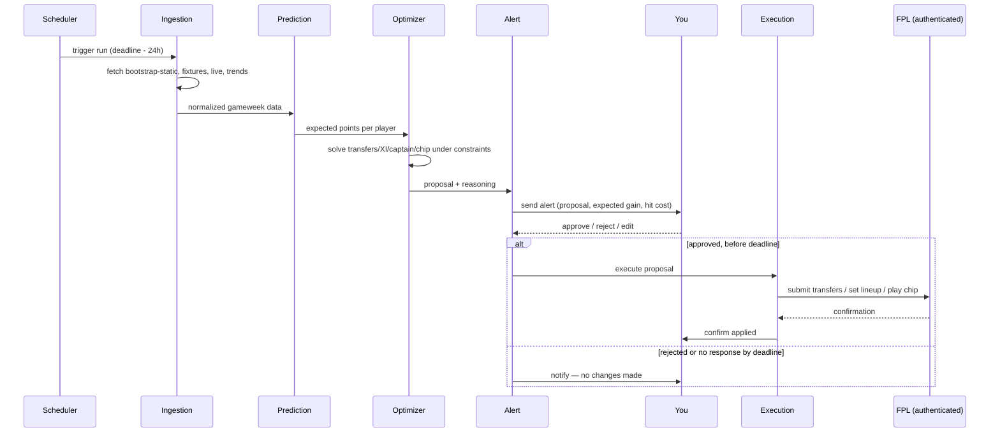

# FPL Assistant Bot — Architecture

A NestJS service that ingests gameweek data, predicts the optimal squad, **alerts you**, and only touches your FPL team after you explicitly approve.

Autonomy mode locked in: **alert → wait for your OK → apply**. Nothing writes to your FPL account without a confirmed response from you.

---

## 1. Constraints that shape the design

- **No official write API.** FPL only publicly documents read endpoints. Setting transfers/lineup means driving the same private endpoints the official web app uses, authenticated as you. This is unsupported by FPL, undocumented, and can change without notice — the execution layer needs to be the most isolated, most defensively-coded part of the system.
- **Deadlines move.** Gameweek deadlines are not reliably "Friday 6PM" — blank/double gameweeks and rescheduled fixtures shift them. The bot must read the actual deadline from the API each cycle, never assume a fixed cron time.
- **Human-in-the-loop is a hard gate, not a notification.** The execution step must be blocked on an explicit approval record, with a defined fallback (do nothing) if you don't respond in time.
- **"Social trends from top FPL players" has no clean API.** Treat this as a curated-sources problem (a watchlist of community sites/rank trackers that already aggregate consensus), not a live social-scraping problem — scraping X/Twitter/YouTube reliably and within ToS is its own project and a fragile foundation to build the rest on.

---

## 2. High-level architecture



---

## 3. Module breakdown

| Module | Responsibility |
|---|---|
| **SchedulerModule** | Cron entry point. On a coarse schedule (e.g. daily), checks `bootstrap-static` for the next deadline and schedules the actual pipeline run for a fixed offset before it (e.g. 24h out) — never hardcodes "Friday." |
| **IngestionModule** | Typed clients for FPL's public endpoints + external stats source. Normalizes into internal `Player`, `Fixture`, `GameweekSnapshot` entities. Idempotent — safe to re-run per gameweek. |
| **TrendsModule** | Pulls from a small, explicit whitelist of consensus/rank-tracker sources you approve in config (not open-ended scraping). Produces a lightweight "template team" / differential signal to feed the model, clearly labeled as a secondary signal. |
| **PredictionModule** | Feature engineering (form, fixture difficulty, underlying stats, price/ownership deltas, minutes risk) → expected-points score per player per fixture. Model swappable behind an interface (`PredictionStrategy`) — start heuristic, upgrade to a trained model later without touching the rest of the pipeline. |
| **OptimizationModule** | Given predicted points + budget/formation/club-limit constraints + current squad, solves for the best transfer(s), starting XI, captain/vice, and bench order. Also evaluates whether a chip is worth playing this week. Integer/linear programming, not a greedy heuristic. |
| **ProposalModule** | Packages the optimizer's output into a `Proposal` record: recommended changes, expected point delta, reasoning summary, and a hit cost if applicable. Persisted with status `PENDING`. |
| **AlertModule** | Renders the proposal into a human-readable message and sends it through your chosen channel, with an explicit approve/reject/edit action. |
| **ApprovalModule** | Owns the state machine: `PENDING → APPROVED / REJECTED / EXPIRED`. Only a signed, verifiable response from you moves it out of `PENDING`. If deadline passes with no response, it auto-expires — **the fallback on silence is always "do nothing,"** never "apply anyway." |
| **ExecutionModule** | The only module allowed to call FPL's authenticated endpoints. Triggered exclusively by an `APPROVED` proposal, re-validates the deadline hasn't passed, applies the change, and writes a full audit record (payload sent, response received, timestamp). |

---

## 4. Data sources

| Source | Type | Use |
|---|---|---|
| `GET /api/bootstrap-static/` | Public | Players, teams, gameweek metadata, **deadline times**, price/ownership snapshot |
| `GET /api/fixtures/?event={gw}` | Public | Fixture list & difficulty for a gameweek |
| `GET /api/element-summary/{id}/` | Public | Per-player fixture history and upcoming fixtures |
| `GET /api/event/{gw}/live/` | Public | Live per-player stats once a gameweek is underway (for post-hoc model evaluation) |
| `GET /api/entry/{teamId}/` , `/history/`, `/event/{gw}/picks/` | Public | Your own team's current state and history |
| External xG/xA source (e.g. Understat) | Public, unofficial | Underlying-stats features the FPL API doesn't expose |
| Curated trend sources (config-driven whitelist) | Public, unofficial | Community consensus / template-team signal |
| `POST https://users.premierleague.com/accounts/login/` | Authenticated | Session login (email/password → session cookie) |
| `GET/POST /api/my-team/{teamId}/` | Authenticated | Read/write your current squad, lineup, captain, chip |
| `POST /api/transfers/` | Authenticated | Submit transfers |

The authenticated endpoints are undocumented and only known through community reverse-engineering — before building `ExecutionModule`, capture the exact request/response shapes yourself via your browser's network tab while making a manual transfer, rather than trusting a third-party writeup verbatim. Contracts here can drift season to season.

---

## 5. Weekly pipeline (sequence)



---

## 6. Persistence (core schema, sketch)

```
Gameweek(id, deadline_at, is_current, is_next)
PlayerSnapshot(gameweek_id, player_id, price, ownership_pct, predicted_points, form, xg, xa, ...)
Proposal(id, gameweek_id, transfers_json, lineup_json, captain_id, chip, expected_gain, hit_cost, status, created_at)
Approval(proposal_id, decided_by, decision, decided_at)
ExecutionLog(proposal_id, request_payload, response_payload, applied_at, success)
```

Keeping `PlayerSnapshot` per gameweek (not overwritten) gives you a backtestable history — essential for eventually checking whether the prediction model is actually adding value over a naive baseline (e.g. "just captain the highest-owned premium").

---

## 7. Notification & approval channel

Needs to be two-way, not just push. A few options, roughly in order of how little glue code they need:

- **Telegram bot** — free, trivial NestJS integration, native inline "Approve / Reject" buttons, webhook delivers the reply straight back into `ApprovalModule`. Easiest fit for this exact flow.
- **Email + a signed one-click link** — works everywhere, slightly more plumbing (need a small web endpoint for the link to hit).
- **Push notification service** (e.g. Pushover/ntfy) — simple to send, but round-tripping an approval back in usually still needs a companion channel (link or reply).

Whichever you pick, the approval record should be cryptographically tied to the specific proposal (a signed token, not just "reply OK") so a stray message can't accidentally approve the wrong week.

---

## 8. Tech stack recommendation

| Concern | Suggestion |
|---|---|
| Framework | NestJS + TypeScript (as planned) |
| Scheduling | `@nestjs/schedule` for the coarse daily check; a queue (BullMQ + Redis) for the actual pipeline run so retries/backoff are handled properly |
| DB | Postgres + Prisma or TypeORM |
| Optimization | `javascript-lp-solver` (pure TS, fine for squad-sized ILP) — or, if the model outgrows it, a small internal Python microservice (PuLP/OR-Tools) called over HTTP, keeping NestJS as the orchestrator |
| HTTP client for FPL | `axios`/`undici` with a dedicated cookie-jar-aware client for the authenticated session, isolated in `ExecutionModule` only |
| Secrets | FPL credentials/session in a secrets manager or encrypted env store — never in the repo, never logged |
| Notifications | Telegram Bot API (see §7) |

---

## 9. Suggested module/folder layout

```
src/
  ingestion/
    fpl-public.client.ts
    stats-provider.client.ts
    ingestion.service.ts
  trends/
    trend-sources.config.ts
    trends.service.ts
  prediction/
    prediction.strategy.ts        # interface
    heuristic.strategy.ts         # v1
    trained-model.strategy.ts     # v2, later
  optimization/
    squad-optimizer.service.ts
    chip-evaluator.service.ts
  proposal/
    proposal.entity.ts
    proposal.service.ts
  alert/
    telegram.adapter.ts
    alert.service.ts
  approval/
    approval.state-machine.ts
    approval.controller.ts        # webhook for your reply
  execution/
    fpl-auth.client.ts            # isolated, most sensitive module
    execution.service.ts
  scheduler/
    deadline-watcher.service.ts
```

---

## 10. Risks & mitigations

| Risk | Mitigation |
|---|---|
| FPL changes/blocks the unofficial write endpoints | Keep `ExecutionModule` fully isolated behind an interface; treat it as the one part of the system expected to need occasional repair; alert loudly (not silently) on execution failure |
| Wrong deadline assumption causes a missed or late change | Always derive the deadline from `bootstrap-static` per run; schedule with margin; re-check immediately before executing |
| Approval race / stale proposal | Bind approvals to a specific proposal ID + gameweek; reject any approval that arrives after that gameweek's deadline |
| Credential compromise | Isolate credentials to the execution module only; encrypt at rest; rotate session rather than storing raw password where possible |
| Model overconfidence | Log every proposal's predicted vs. actual points; treat prediction as a decision-support signal, not a guarantee — realistically, beating informed human consensus by a wide margin is hard |
| Scraping social/trend sources breaks or gets blocked | Use a small explicit source whitelist you control, not open-ended scraping; degrade gracefully (proceed on model + fixtures alone) if a source is unavailable |

---

## 11. Suggested build order

1. **Ingestion + prediction + optimization, recommend-only.** No execution module at all yet — just get a weekly Telegram message with a proposed team and confidence you'd actually want to send it.
2. **Add the approval state machine and alert loop**, still without execution — verify the "propose → you decide → expire on silence" flow end-to-end.
3. **Add `ExecutionModule` for lineup/captain changes only** (lower risk than transfers) once the flow above is trustworthy.
4. **Extend execution to transfers and chips**, with the audit log and rollback story proven out first.
5. **Iterate the prediction model** using the backtestable `PlayerSnapshot` history from step 1 onward.

---

## Sources

- [Oliver Looney — FPL APIs Explained](https://www.oliverlooney.com/blogs/FPL-APIs-Explained)
- [FPL API cheatsheet (sertalpbilal, via glama mirror)](https://glama.ai/mcp/servers/@owen-lacey/fpl-mcp/blob/e9171d6bb4bc00c522d02752962554112a340d30/docs/fpl-api-cheatsheet.md)
- [amosbastian/fpl — Python FPL library source](https://github.com/amosbastian/fpl/blob/master/fpl/fpl.py)
- [mcclowes/fpl-oas — Unofficial OpenAPI docs for the FPL API](https://github.com/mcclowes/fpl-oas)
